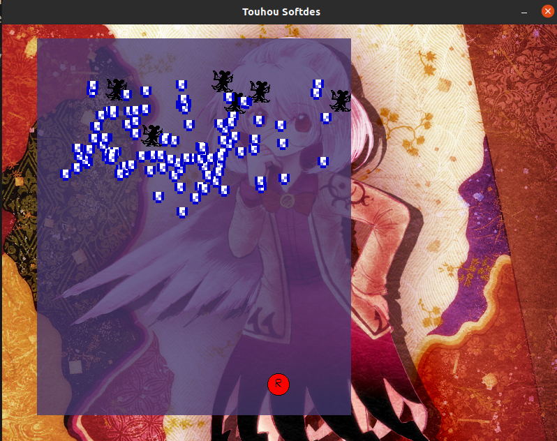
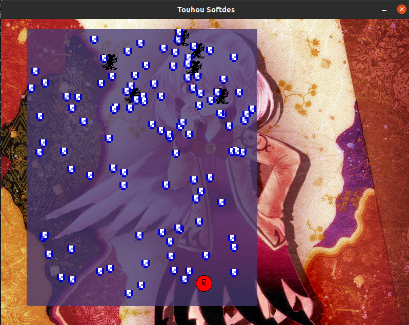
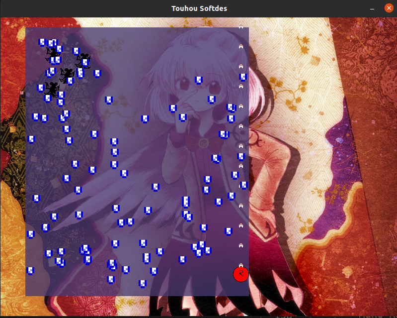

# First Touhou Python

This project is an attempt at remaking a demo of the [Touhou](https://en.wikipedia.org/wiki/Touhou_Project) shooter game, comprised of 6 enemies with a barrage of bullets. The architecture is model-view-controller, or MVC, and the project is mainly using pygame.

[README]()

## Usages
Download the zip file from the right, or use

> git clone https://github.com/olincollege/first_touhou_python.git

Before you run the game, you need to have pygame installed:
> pip install pygame

Then simply run the game:

> python `main.py`

There are no additional changes needed to run the game but note that the image assets are coded to be found within the same directory, so make sure those are within the same folder as the .py files.

## Features

- Hold arrow keys to move the player character
- Hold Left Shift to move the player character at a slower speed
- Hold Z to shoot
- Kill all the enemies to win!

## About the Author

- @alanxurox
- Beijing, China
- Freshman @ Babson College

## Screenshots

## Credits
Background: [@Okizari]https://www.newgrounds.com/art/view/okizari/sagume
